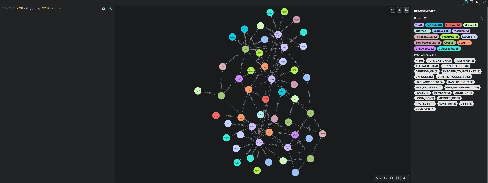
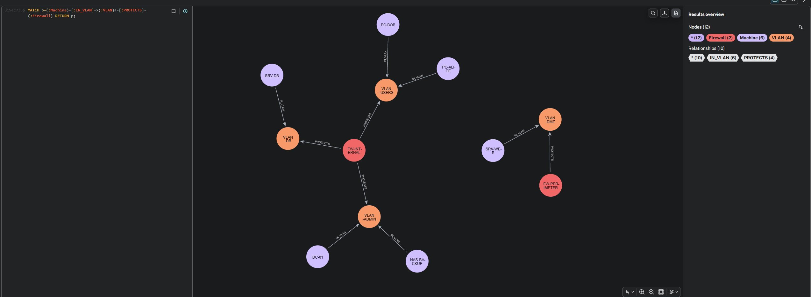

# Livrable 1 — Graphe Neo4j

Projet B3 Cyber — Cartographie du système d'information de CyberCorp et analyse des chemins d'attaque avec Neo4j AuraDB.

---

## 1. Capture d'écran du graphe

### Vue d'ensemble du système d'information

Le graphe complet du SI CyberCorp, composé de 54 nœuds répartis en 14 types et de 89 relations en 21 types.



> Requête utilisée : `MATCH (n) RETURN n;`

### Vue ciblée : la segmentation réseau

Cette vue isole la proposition de segmentation : chaque machine est rattachée à un VLAN, lui-même protégé par un pare-feu.



> Requête utilisée : `MATCH p=(:Machine)-[:IN_VLAN]->(:VLAN)<-[:PROTECTS]-(:Firewall) RETURN p;`

---

## 2. Description du modèle de données

Le système d'information est modélisé sous forme de **graphe orienté** composé de **14 types de nœuds** et **21 types de relations**, pour un total de 54 nœuds et 89 relations.

### Les types de nœuds

Les nœuds représentent les entités du SI. Les entités fondamentales sont :

| Label | Rôle | Exemples |
|-------|------|----------|
| `User` | Comptes humains | alice, bob, charlie, diana, eve |
| `Machine` | Ordinateurs et serveurs | PC-ALICE, SRV-WEB, SRV-DB, DC-01 |
| `Service` | Services réseau exposés | SSH, HTTP, RDP, SMB, MongoDB |
| `Vulnerability` | Failles connues (CVE) | Log4Shell, Zerologon, BlueKeep |
| `Group` | Groupes de droits | RH, DEV, ADMINS, SECURITY |
| `Resource` | Données sensibles | Active Directory, Base clients, Sauvegardes |

À ces entités de base s'ajoutent les éléments d'infrastructure et de sécurité, qui enrichissent l'analyse :

| Label | Rôle | Exemples |
|-------|------|----------|
| `VLAN` | Segments réseau | VLAN-USERS, VLAN-DMZ, VLAN-DB, VLAN-ADMIN |
| `Firewall` | Pare-feux | FW-PERIMETER, FW-INTERNAL |
| `ServiceAccount` | Comptes de service applicatifs | svc-web, svc-backup, svc-sql |
| `ADRight` | Droits Active Directory | DCSync, GenericAll, ResetPassword |
| `VPNAccess` | Accès distants | VPN-NOMADE, VPN-ADMIN |
| `Internet` | Point d'exposition externe | INTERNET |
| `PrivilegeLevel` | Niveaux de privilège | standard, admin, domain_admin |
| `LoginLog` | Événements de connexion | log-001 à log-005 |

### Les types de relations

Les relations décrivent les faits du SI sous forme de liens orientés. Les plus structurantes pour l'analyse cyber sont :

- `CONNECTED_TO` — connexions réseau entre machines ; ce sont elles qui forment les **chemins d'attaque**.
- `HOSTS` — une machine héberge une ressource ; dernier maillon entre un chemin réseau et une cible critique.
- `MEMBER_OF` et `HAS_ACCESS_TO` — héritage de droits via les groupes (chemin utilisateur → groupe → machine).
- `IN_VLAN`, `PROTECTS`, `ALLOWED_TO` — la **segmentation réseau** et le filtrage par pare-feu.
- `HAS_AD_RIGHT` et `AD_RIGHT_ON` — chemins d'attaque **Active Directory**.
- `DEPENDS_ON` — dépendances applicatives entre machines.
- `EXPOSED_TO_INTERNET` — surface d'exposition externe.
- `LOGIN_ON` et `LOGIN_BY` — traçabilité des connexions (succès et échecs).

S'ajoutent les relations `USES`, `ADMIN_OF`, `EXPOSES`, `HAS_VULNERABILITY`, `RUNS_AS`, `GRANTS_ACCESS_TO`, `USES_VPN` et `HAS_PRIVILEGE`.

### Les propriétés

Chaque nœud porte des propriétés qui le qualifient. Par exemple, une `Machine` possède un type, un niveau de criticité et une date de dernier patch (`last_patch_date`) ; une `Vulnerability` porte un score CVSS et un statut de correction (`patch_status`, valant *corrigé*, *non corrigé* ou *en cours*). Des **contraintes d'unicité**, équivalentes à des clés primaires, garantissent l'intégrité du modèle et empêchent les doublons.

### Justification du choix d'une base graphe

Le choix d'une base de données orientée graphe est motivé par la nature du problème. L'analyse des chemins d'attaque consiste à parcourir des relations de longueur variable entre machines, une opération **native et performante** en Cypher (`-[:CONNECTED_TO*1..5]->`), là où une base relationnelle exigerait des jointures récursives complexes et illisibles. Un chemin d'attaque correspond exactement à un parcours de graphe, ce qui rend ce modèle particulièrement adapté.

---

## 3. Script Cypher de création des nœuds

Ce script crée les 54 nœuds du graphe, regroupés par type. Chaque instruction `CREATE (:Label {...})` produit un nœud portant un label (sa catégorie) et ses propriétés (ses attributs). Les nœuds sont créés en premier car les relations, ajoutées ensuite, ont besoin que leurs deux extrémités existent déjà.

```cypher
CREATE (:User {name: "alice",   role: "RH",            privilege: "standard"});
CREATE (:User {name: "bob",     role: "Developpeur",   privilege: "standard"});
CREATE (:User {name: "charlie", role: "Admin Systeme", privilege: "admin"});
CREATE (:User {name: "diana",   role: "RSSI",          privilege: "admin"});
CREATE (:User {name: "eve",     role: "Stagiaire",     privilege: "standard"});

CREATE (:Machine {name: "PC-ALICE",   type: "workstation",       criticality: "low",      last_patch_date: "2025-01-15"});
CREATE (:Machine {name: "PC-BOB",     type: "workstation",       criticality: "medium",   last_patch_date: "2024-11-03"});
CREATE (:Machine {name: "SRV-WEB",    type: "server",            criticality: "medium",   last_patch_date: "2024-08-20"});
CREATE (:Machine {name: "SRV-DB",     type: "database",          criticality: "high",     last_patch_date: "2025-02-10"});
CREATE (:Machine {name: "DC-01",      type: "domain_controller", criticality: "critical", last_patch_date: "2024-06-01"});
CREATE (:Machine {name: "NAS-BACKUP", type: "backup_server",     criticality: "critical", last_patch_date: "2024-09-12"});

CREATE (:Service {name: "SSH",     port: 22});
CREATE (:Service {name: "HTTP",    port: 80});
CREATE (:Service {name: "HTTPS",   port: 443});
CREATE (:Service {name: "RDP",     port: 3389});
CREATE (:Service {name: "SMB",     port: 445});
CREATE (:Service {name: "MongoDB", port: 27017});

CREATE (:Vulnerability {cve: "CVE-2021-44228", name: "Log4Shell",            score: 10.0, patch_status: "non corrige", description: "Execution de code a distance via Log4j"});
CREATE (:Vulnerability {cve: "CVE-2020-1472",  name: "Zerologon",            score: 10.0, patch_status: "non corrige", description: "Elevation de privileges sur controleur de domaine"});
CREATE (:Vulnerability {cve: "CVE-2019-0708",  name: "BlueKeep",             score: 9.8,  patch_status: "corrige",     description: "Execution de code a distance via RDP"});
CREATE (:Vulnerability {cve: "CVE-2022-22965", name: "Spring4Shell",         score: 9.8,  patch_status: "non corrige", description: "Execution de code a distance sur application Spring"});
CREATE (:Vulnerability {cve: "CVE-2023-0001",  name: "SMB Misconfiguration", score: 7.5,  patch_status: "en cours",    description: "Mauvaise configuration du partage SMB"});

CREATE (:Group {name: "RH"});
CREATE (:Group {name: "DEV"});
CREATE (:Group {name: "ADMINS"});
CREATE (:Group {name: "SECURITY"});

CREATE (:Resource {name: "Base clients",        sensitivity: "high"});
CREATE (:Resource {name: "Donnees RH",          sensitivity: "high"});
CREATE (:Resource {name: "Active Directory",    sensitivity: "critical"});
CREATE (:Resource {name: "Sauvegardes",         sensitivity: "critical"});
CREATE (:Resource {name: "Secrets applicatifs", sensitivity: "critical"});

CREATE (:VLAN {name: "VLAN-USERS", vlan_id: 10, zone: "utilisateurs"});
CREATE (:VLAN {name: "VLAN-DMZ",   vlan_id: 20, zone: "dmz"});
CREATE (:VLAN {name: "VLAN-DB",    vlan_id: 30, zone: "donnees"});
CREATE (:VLAN {name: "VLAN-ADMIN", vlan_id: 40, zone: "administration"});

CREATE (:Firewall {name: "FW-PERIMETER", type: "perimetre"});
CREATE (:Firewall {name: "FW-INTERNAL",  type: "interne"});

CREATE (:ServiceAccount {name: "svc-web",    description: "compte de service application web"});
CREATE (:ServiceAccount {name: "svc-backup", description: "compte de service sauvegarde"});
CREATE (:ServiceAccount {name: "svc-sql",    description: "compte de service base de donnees"});

CREATE (:ADRight {name: "DCSync",        level: "critical", description: "replication des secrets du domaine"});
CREATE (:ADRight {name: "GenericAll",    level: "critical", description: "controle total sur un objet AD"});
CREATE (:ADRight {name: "ResetPassword", level: "high",     description: "reinitialisation de mot de passe"});

CREATE (:VPNAccess {name: "VPN-NOMADE", type: "acces distant collaborateurs"});
CREATE (:VPNAccess {name: "VPN-ADMIN",  type: "acces distant administrateurs"});

CREATE (:Internet {name: "INTERNET", zone: "externe"});

CREATE (:PrivilegeLevel {name: "standard",     rank: 1});
CREATE (:PrivilegeLevel {name: "admin",        rank: 3});
CREATE (:PrivilegeLevel {name: "domain_admin", rank: 5});

CREATE (:LoginLog {id: "log-001", status: "success", failed_attempts: 0,  timestamp: "2025-06-01T08:12:00"});
CREATE (:LoginLog {id: "log-002", status: "failed",  failed_attempts: 5,  timestamp: "2025-06-01T09:47:00"});
CREATE (:LoginLog {id: "log-003", status: "success", failed_attempts: 0,  timestamp: "2025-06-01T10:03:00"});
CREATE (:LoginLog {id: "log-004", status: "success", failed_attempts: 0,  timestamp: "2025-06-01T11:25:00"});
CREATE (:LoginLog {id: "log-005", status: "failed",  failed_attempts: 12, timestamp: "2025-06-01T23:58:00"});
```

---

## 4. Script Cypher de création des relations

Ce script crée les 89 relations qui relient les nœuds. Chaque instruction suit le même principe en deux temps : un `MATCH` retrouve les deux nœuds à relier grâce à leur identifiant (leur `name`, `cve` ou `id`), puis un `CREATE` établit la flèche orientée entre eux. Les relations sont regroupées par type ; le sens de chaque flèche traduit un fait du SI (par exemple, `(machine)-[:CONNECTED_TO]->(machine)` signifie que la première peut joindre la seconde sur le réseau).

```cypher
MATCH (u:User {name: "alice"}),   (m:Machine {name: "PC-ALICE"}) CREATE (u)-[:USES]->(m);
MATCH (u:User {name: "bob"}),     (m:Machine {name: "PC-BOB"})   CREATE (u)-[:USES]->(m);
MATCH (u:User {name: "charlie"}), (m:Machine {name: "DC-01"})    CREATE (u)-[:USES]->(m);
MATCH (u:User {name: "diana"}),   (m:Machine {name: "PC-BOB"})   CREATE (u)-[:USES]->(m);
MATCH (u:User {name: "eve"}),     (m:Machine {name: "PC-ALICE"}) CREATE (u)-[:USES]->(m);

MATCH (u:User {name: "alice"}),   (g:Group {name: "RH"})       CREATE (u)-[:MEMBER_OF]->(g);
MATCH (u:User {name: "bob"}),     (g:Group {name: "DEV"})      CREATE (u)-[:MEMBER_OF]->(g);
MATCH (u:User {name: "charlie"}), (g:Group {name: "ADMINS"})   CREATE (u)-[:MEMBER_OF]->(g);
MATCH (u:User {name: "diana"}),   (g:Group {name: "SECURITY"}) CREATE (u)-[:MEMBER_OF]->(g);
MATCH (u:User {name: "eve"}),     (g:Group {name: "DEV"})      CREATE (u)-[:MEMBER_OF]->(g);

MATCH (u:User {name: "charlie"}), (m:Machine {name: "DC-01"})      CREATE (u)-[:ADMIN_OF]->(m);
MATCH (u:User {name: "charlie"}), (m:Machine {name: "NAS-BACKUP"}) CREATE (u)-[:ADMIN_OF]->(m);
MATCH (u:User {name: "charlie"}), (m:Machine {name: "SRV-DB"})     CREATE (u)-[:ADMIN_OF]->(m);

MATCH (a:Machine {name: "PC-ALICE"}), (b:Machine {name: "SRV-WEB"})    CREATE (a)-[:CONNECTED_TO]->(b);
MATCH (a:Machine {name: "PC-BOB"}),   (b:Machine {name: "SRV-WEB"})    CREATE (a)-[:CONNECTED_TO]->(b);
MATCH (a:Machine {name: "SRV-WEB"}),  (b:Machine {name: "SRV-DB"})     CREATE (a)-[:CONNECTED_TO]->(b);
MATCH (a:Machine {name: "SRV-DB"}),   (b:Machine {name: "DC-01"})      CREATE (a)-[:CONNECTED_TO]->(b);
MATCH (a:Machine {name: "SRV-DB"}),   (b:Machine {name: "NAS-BACKUP"}) CREATE (a)-[:CONNECTED_TO]->(b);
MATCH (a:Machine {name: "PC-ALICE"}), (b:Machine {name: "PC-BOB"})     CREATE (a)-[:CONNECTED_TO]->(b);

MATCH (m:Machine {name: "SRV-WEB"}),    (s:Service {name: "HTTP"})    CREATE (m)-[:EXPOSES]->(s);
MATCH (m:Machine {name: "SRV-WEB"}),    (s:Service {name: "HTTPS"})   CREATE (m)-[:EXPOSES]->(s);
MATCH (m:Machine {name: "SRV-DB"}),     (s:Service {name: "MongoDB"}) CREATE (m)-[:EXPOSES]->(s);
MATCH (m:Machine {name: "DC-01"}),      (s:Service {name: "SMB"})     CREATE (m)-[:EXPOSES]->(s);
MATCH (m:Machine {name: "PC-BOB"}),     (s:Service {name: "RDP"})     CREATE (m)-[:EXPOSES]->(s);
MATCH (m:Machine {name: "NAS-BACKUP"}), (s:Service {name: "SMB"})     CREATE (m)-[:EXPOSES]->(s);

MATCH (m:Machine {name: "SRV-WEB"}),    (v:Vulnerability {cve: "CVE-2021-44228"}) CREATE (m)-[:HAS_VULNERABILITY]->(v);
MATCH (m:Machine {name: "SRV-WEB"}),    (v:Vulnerability {cve: "CVE-2022-22965"}) CREATE (m)-[:HAS_VULNERABILITY]->(v);
MATCH (m:Machine {name: "PC-BOB"}),     (v:Vulnerability {cve: "CVE-2019-0708"})  CREATE (m)-[:HAS_VULNERABILITY]->(v);
MATCH (m:Machine {name: "DC-01"}),      (v:Vulnerability {cve: "CVE-2020-1472"})  CREATE (m)-[:HAS_VULNERABILITY]->(v);
MATCH (m:Machine {name: "NAS-BACKUP"}), (v:Vulnerability {cve: "CVE-2023-0001"})  CREATE (m)-[:HAS_VULNERABILITY]->(v);

MATCH (g:Group {name: "RH"}),     (m:Machine {name: "SRV-WEB"})    CREATE (g)-[:HAS_ACCESS_TO]->(m);
MATCH (g:Group {name: "DEV"}),    (m:Machine {name: "SRV-DB"})     CREATE (g)-[:HAS_ACCESS_TO]->(m);
MATCH (g:Group {name: "ADMINS"}), (m:Machine {name: "DC-01"})      CREATE (g)-[:HAS_ACCESS_TO]->(m);
MATCH (g:Group {name: "ADMINS"}), (m:Machine {name: "NAS-BACKUP"}) CREATE (g)-[:HAS_ACCESS_TO]->(m);

MATCH (m:Machine {name: "SRV-DB"}),     (r:Resource {name: "Base clients"})        CREATE (m)-[:HOSTS]->(r);
MATCH (m:Machine {name: "SRV-DB"}),     (r:Resource {name: "Secrets applicatifs"}) CREATE (m)-[:HOSTS]->(r);
MATCH (m:Machine {name: "DC-01"}),      (r:Resource {name: "Active Directory"})    CREATE (m)-[:HOSTS]->(r);
MATCH (m:Machine {name: "NAS-BACKUP"}), (r:Resource {name: "Sauvegardes"})         CREATE (m)-[:HOSTS]->(r);
MATCH (m:Machine {name: "SRV-WEB"}),    (r:Resource {name: "Donnees RH"})          CREATE (m)-[:HOSTS]->(r);

MATCH (m:Machine {name: "PC-ALICE"}),   (v:VLAN {name: "VLAN-USERS"}) CREATE (m)-[:IN_VLAN]->(v);
MATCH (m:Machine {name: "PC-BOB"}),     (v:VLAN {name: "VLAN-USERS"}) CREATE (m)-[:IN_VLAN]->(v);
MATCH (m:Machine {name: "SRV-WEB"}),    (v:VLAN {name: "VLAN-DMZ"})   CREATE (m)-[:IN_VLAN]->(v);
MATCH (m:Machine {name: "SRV-DB"}),     (v:VLAN {name: "VLAN-DB"})    CREATE (m)-[:IN_VLAN]->(v);
MATCH (m:Machine {name: "DC-01"}),      (v:VLAN {name: "VLAN-ADMIN"}) CREATE (m)-[:IN_VLAN]->(v);
MATCH (m:Machine {name: "NAS-BACKUP"}), (v:VLAN {name: "VLAN-ADMIN"}) CREATE (m)-[:IN_VLAN]->(v);

MATCH (f:Firewall {name: "FW-PERIMETER"}), (v:VLAN {name: "VLAN-DMZ"})   CREATE (f)-[:PROTECTS]->(v);
MATCH (f:Firewall {name: "FW-INTERNAL"}),  (v:VLAN {name: "VLAN-USERS"}) CREATE (f)-[:PROTECTS]->(v);
MATCH (f:Firewall {name: "FW-INTERNAL"}),  (v:VLAN {name: "VLAN-DB"})    CREATE (f)-[:PROTECTS]->(v);
MATCH (f:Firewall {name: "FW-INTERNAL"}),  (v:VLAN {name: "VLAN-ADMIN"}) CREATE (f)-[:PROTECTS]->(v);

MATCH (a:VLAN {name: "VLAN-USERS"}), (b:VLAN {name: "VLAN-DMZ"})   CREATE (a)-[:ALLOWED_TO]->(b);
MATCH (a:VLAN {name: "VLAN-DMZ"}),   (b:VLAN {name: "VLAN-DB"})    CREATE (a)-[:ALLOWED_TO]->(b);
MATCH (a:VLAN {name: "VLAN-ADMIN"}), (b:VLAN {name: "VLAN-DB"})    CREATE (a)-[:ALLOWED_TO]->(b);
MATCH (a:VLAN {name: "VLAN-ADMIN"}), (b:VLAN {name: "VLAN-ADMIN"}) CREATE (a)-[:ALLOWED_TO]->(b);

MATCH (m:Machine {name: "SRV-WEB"}),    (s:ServiceAccount {name: "svc-web"})    CREATE (m)-[:RUNS_AS]->(s);
MATCH (m:Machine {name: "NAS-BACKUP"}), (s:ServiceAccount {name: "svc-backup"}) CREATE (m)-[:RUNS_AS]->(s);
MATCH (m:Machine {name: "SRV-DB"}),     (s:ServiceAccount {name: "svc-sql"})    CREATE (m)-[:RUNS_AS]->(s);

MATCH (n {name: "svc-web"}), (a:ADRight {name: "ResetPassword"}) CREATE (n)-[:HAS_AD_RIGHT]->(a);
MATCH (n {name: "charlie"}), (a:ADRight {name: "DCSync"})        CREATE (n)-[:HAS_AD_RIGHT]->(a);
MATCH (n {name: "charlie"}), (a:ADRight {name: "GenericAll"})    CREATE (n)-[:HAS_AD_RIGHT]->(a);
MATCH (n {name: "eve"}),     (a:ADRight {name: "ResetPassword"}) CREATE (n)-[:HAS_AD_RIGHT]->(a);

MATCH (a:ADRight {name: "DCSync"}),        (r:Resource {name: "Active Directory"}) CREATE (a)-[:AD_RIGHT_ON]->(r);
MATCH (a:ADRight {name: "GenericAll"}),    (r:Resource {name: "Active Directory"}) CREATE (a)-[:AD_RIGHT_ON]->(r);
MATCH (a:ADRight {name: "ResetPassword"}), (r:Resource {name: "Active Directory"}) CREATE (a)-[:AD_RIGHT_ON]->(r);

MATCH (v:VPNAccess {name: "VPN-NOMADE"}), (vl:VLAN {name: "VLAN-USERS"}) CREATE (v)-[:GRANTS_ACCESS_TO]->(vl);
MATCH (v:VPNAccess {name: "VPN-ADMIN"}),  (vl:VLAN {name: "VLAN-ADMIN"}) CREATE (v)-[:GRANTS_ACCESS_TO]->(vl);

MATCH (u:User {name: "alice"}),   (v:VPNAccess {name: "VPN-NOMADE"}) CREATE (u)-[:USES_VPN]->(v);
MATCH (u:User {name: "eve"}),     (v:VPNAccess {name: "VPN-NOMADE"}) CREATE (u)-[:USES_VPN]->(v);
MATCH (u:User {name: "charlie"}), (v:VPNAccess {name: "VPN-ADMIN"})  CREATE (u)-[:USES_VPN]->(v);
MATCH (u:User {name: "diana"}),   (v:VPNAccess {name: "VPN-ADMIN"})  CREATE (u)-[:USES_VPN]->(v);

MATCH (n {name: "SRV-WEB"}),    (i:Internet {name: "INTERNET"}) CREATE (n)-[:EXPOSED_TO_INTERNET]->(i);
MATCH (n {name: "VPN-NOMADE"}), (i:Internet {name: "INTERNET"}) CREATE (n)-[:EXPOSED_TO_INTERNET]->(i);
MATCH (n {name: "VPN-ADMIN"}),  (i:Internet {name: "INTERNET"}) CREATE (n)-[:EXPOSED_TO_INTERNET]->(i);

MATCH (u:User {name: "alice"}),   (p:PrivilegeLevel {name: "standard"}) CREATE (u)-[:HAS_PRIVILEGE]->(p);
MATCH (u:User {name: "bob"}),     (p:PrivilegeLevel {name: "standard"}) CREATE (u)-[:HAS_PRIVILEGE]->(p);
MATCH (u:User {name: "eve"}),     (p:PrivilegeLevel {name: "standard"}) CREATE (u)-[:HAS_PRIVILEGE]->(p);
MATCH (u:User {name: "charlie"}), (p:PrivilegeLevel {name: "admin"})    CREATE (u)-[:HAS_PRIVILEGE]->(p);
MATCH (u:User {name: "diana"}),   (p:PrivilegeLevel {name: "admin"})    CREATE (u)-[:HAS_PRIVILEGE]->(p);

MATCH (a:Machine {name: "SRV-WEB"}),    (b:Machine {name: "SRV-DB"}) CREATE (a)-[:DEPENDS_ON]->(b);
MATCH (a:Machine {name: "SRV-DB"}),     (b:Machine {name: "DC-01"})  CREATE (a)-[:DEPENDS_ON]->(b);
MATCH (a:Machine {name: "NAS-BACKUP"}), (b:Machine {name: "DC-01"})  CREATE (a)-[:DEPENDS_ON]->(b);

MATCH (l:LoginLog {id: "log-001"}), (m:Machine {name: "PC-ALICE"}) CREATE (l)-[:LOGIN_ON]->(m);
MATCH (l:LoginLog {id: "log-002"}), (m:Machine {name: "PC-ALICE"}) CREATE (l)-[:LOGIN_ON]->(m);
MATCH (l:LoginLog {id: "log-003"}), (m:Machine {name: "SRV-WEB"})  CREATE (l)-[:LOGIN_ON]->(m);
MATCH (l:LoginLog {id: "log-004"}), (m:Machine {name: "DC-01"})    CREATE (l)-[:LOGIN_ON]->(m);
MATCH (l:LoginLog {id: "log-005"}), (m:Machine {name: "DC-01"})    CREATE (l)-[:LOGIN_ON]->(m);

MATCH (l:LoginLog {id: "log-001"}), (u:User {name: "alice"})   CREATE (l)-[:LOGIN_BY]->(u);
MATCH (l:LoginLog {id: "log-002"}), (u:User {name: "eve"})     CREATE (l)-[:LOGIN_BY]->(u);
MATCH (l:LoginLog {id: "log-004"}), (u:User {name: "charlie"}) CREATE (l)-[:LOGIN_BY]->(u);
MATCH (l:LoginLog {id: "log-005"}), (u:User {name: "eve"})     CREATE (l)-[:LOGIN_BY]->(u);
```

---

## Récapitulatif

| Élément | Quantité |
|---------|----------|
| Types de nœuds | 14 |
| Total de nœuds | 54 |
| Types de relations | 21 |
| Total de relations | 89 |

> Le script Cypher complet est disponible dans le fichier [`creation_graphe.cypher`](creation_graphe.cypher). Une version Python automatisée (bonus) est disponible dans [`projetnosql.py`](projetnosql.py).
