# Livrable 2 — Requêtes Cypher

Projet B3 Cyber — CyberCorp. Ce livrable présente les requêtes Cypher de création et d'analyse, accompagnées des résultats obtenus dans Neo4j AuraDB et d'un commentaire expliquant chaque résultat.

Les requêtes sont numérotées de R1 à R14 : trois requêtes de création (R1 à R3) et onze requêtes d'analyse (R4 à R14).

---

## Partie A — Requêtes de création

### R1 — Création de nœuds (utilisateurs)

```cypher
CREATE (:User {name: "alice",   role: "RH",            privilege: "standard"})
CREATE (:User {name: "bob",     role: "Developpeur",   privilege: "standard"})
CREATE (:User {name: "charlie", role: "Admin Systeme", privilege: "admin"})
CREATE (:User {name: "diana",   role: "RSSI",          privilege: "admin"})
CREATE (:User {name: "eve",     role: "Stagiaire",     privilege: "standard"});
```

**Résultat :**

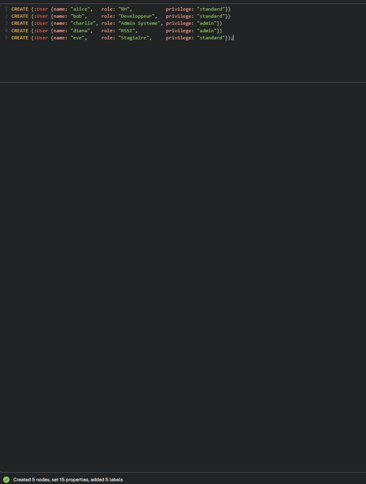

**Commentaire :** Cette requête crée les cinq comptes utilisateurs du système d'information. Chaque instruction `CREATE (:User {...})` produit un nœud portant le label `User` et trois propriétés (nom, rôle et niveau de privilège). Le message de confirmation « Created 5 nodes, set 15 properties, added 5 labels » valide la création des cinq nœuds et de leurs quinze propriétés (trois par utilisateur). C'est l'opération de base de peuplement du graphe.

### R2 — Création de nœuds (machines)

```cypher
CREATE (:Machine {name: "PC-ALICE",   type: "workstation",       criticality: "low",      last_patch_date: "2025-01-15"})
CREATE (:Machine {name: "PC-BOB",     type: "workstation",       criticality: "medium",   last_patch_date: "2024-11-03"})
CREATE (:Machine {name: "SRV-WEB",    type: "server",            criticality: "medium",   last_patch_date: "2024-08-20"})
CREATE (:Machine {name: "SRV-DB",     type: "database",          criticality: "high",     last_patch_date: "2025-02-10"})
CREATE (:Machine {name: "DC-01",      type: "domain_controller", criticality: "critical", last_patch_date: "2024-06-01"})
CREATE (:Machine {name: "NAS-BACKUP", type: "backup_server",     criticality: "critical", last_patch_date: "2024-09-12"});
```

**Résultat :**

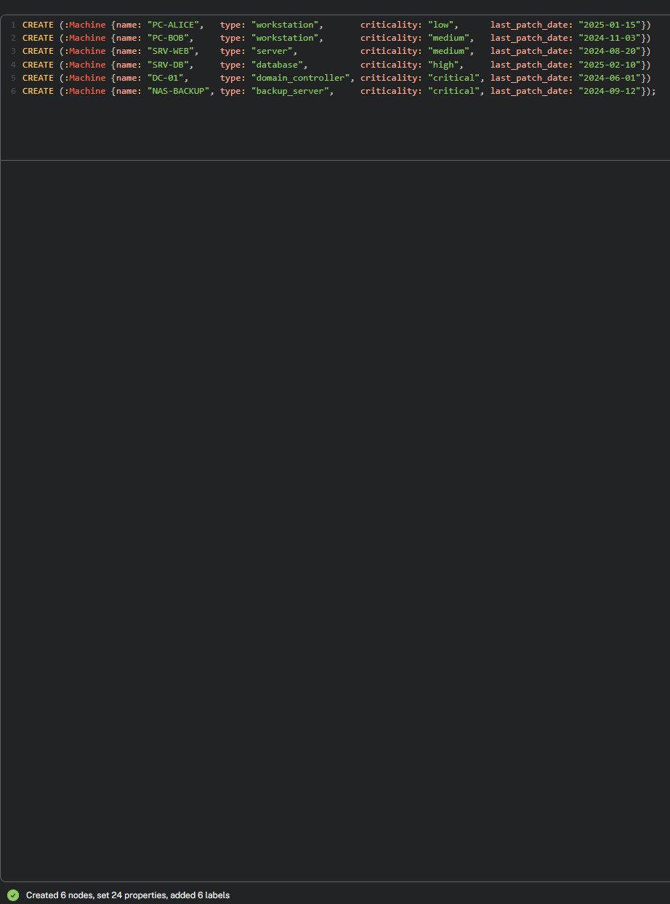

**Commentaire :** Cette requête crée les six machines du parc, chacune avec son type, son niveau de criticité et sa date de dernier correctif. Le message « Created 6 nodes, set 24 properties, added 6 labels » confirme la création des six nœuds et de leurs vingt-quatre propriétés (quatre par machine). Ces nœuds doivent exister avant de pouvoir créer les relations réseau qui les relient.

### R3 — Création de relations (connexions réseau)

```cypher
MATCH (a:Machine {name: "PC-ALICE"}), (b:Machine {name: "SRV-WEB"}) CREATE (a)-[:CONNECTED_TO]->(b)
WITH 1 AS _
MATCH (a:Machine {name: "SRV-WEB"}), (b:Machine {name: "SRV-DB"})  CREATE (a)-[:CONNECTED_TO]->(b)
WITH 1 AS _
MATCH (a:Machine {name: "SRV-DB"}), (b:Machine {name: "DC-01"})    CREATE (a)-[:CONNECTED_TO]->(b);
```

**Résultat :**

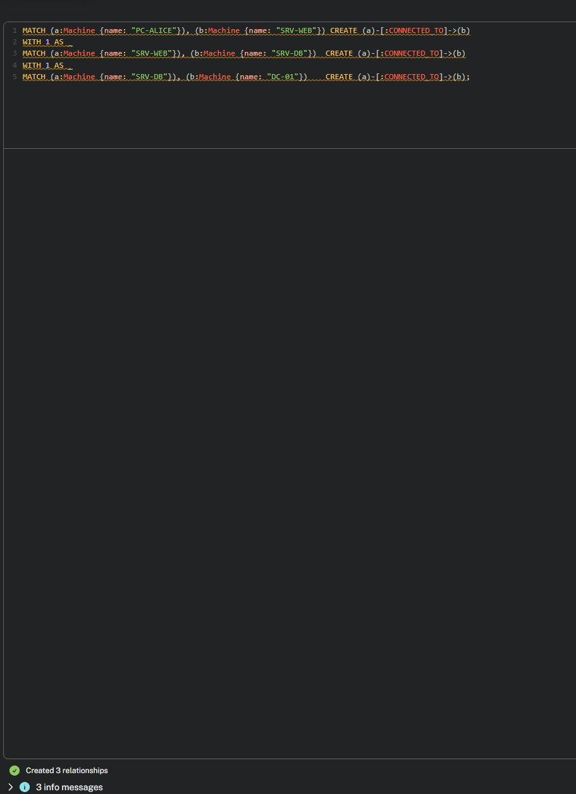

**Commentaire :** Cette requête crée les connexions réseau entre machines. Chaque relation se construit en deux temps : un `MATCH` retrouve les deux machines concernées, puis un `CREATE` établit la flèche orientée `CONNECTED_TO` entre elles. La clause `WITH 1 AS _` permet de chaîner plusieurs créations dans une seule requête. Le message « Created 3 relationships » confirme la création des trois liaisons formant le début du chemin d'attaque `PC-ALICE → SRV-WEB → SRV-DB → DC-01`. On ne peut pas créer une relation sans que ses deux extrémités existent déjà, d'où la nécessité d'avoir créé les machines au préalable (R2).

---

## Partie B — Requêtes d'analyse

### R4 — Inventaire des nœuds par type

```cypher
MATCH (n)
RETURN labels(n)[0] AS type, count(*) AS nombre
ORDER BY nombre DESC;
```

**Résultat :**

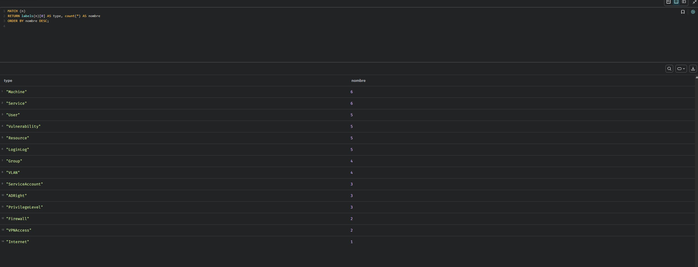

**Commentaire :** Cette requête recense les nœuds du graphe par type. Elle confirme que le modèle compte 14 types de nœuds pour un total de 54 nœuds, répartis entre les entités de base (Machine, Service, User, Vulnerability, Resource, Group) et les entités d'enrichissement liées à la sécurité (VLAN, Firewall, ServiceAccount, ADRight, VPNAccess, PrivilegeLevel, Internet, LoginLog). Elle sert de vue d'inventaire du système d'information modélisé.

### R5 — Chemin d'attaque vers le contrôleur de domaine

```cypher
MATCH path = (start:Machine {name: "PC-ALICE"})-[:CONNECTED_TO*1..5]->(target:Machine {name: "DC-01"})
RETURN path;
```

**Résultat :**

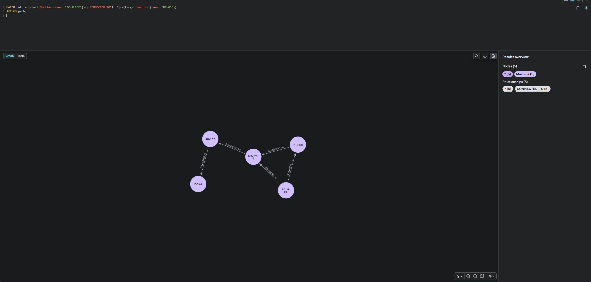

**Commentaire :** Cette requête recherche tous les chemins réseau menant du poste compromis PC-ALICE jusqu'au contrôleur de domaine DC-01, en suivant la relation CONNECTED_TO sur 1 à 5 sauts. Le résultat démontre qu'un attaquant ayant compromis PC-ALICE peut atteindre DC-01 via le chemin `PC-ALICE → SRV-WEB → SRV-DB → DC-01`, soit seulement 3 sauts réseau. La visualisation fait apparaître que ce chemin passe par le serveur web puis le serveur de base de données avant d'atteindre le cœur du domaine, illustrant concrètement le mouvement latéral. C'est le résultat central du projet : il prouve qu'un simple poste utilisateur compromis ouvre l'accès à la ressource la plus critique du système d'information.

### R6 — Tous les chemins vers les machines critiques

```cypher
MATCH path = (start:Machine {name: "PC-ALICE"})-[:CONNECTED_TO*1..5]->(target:Machine)
WHERE target.criticality = "critical"
RETURN target.name AS cible, length(path) AS nombre_de_sauts, [n IN nodes(path) | n.name] AS chemin
ORDER BY nombre_de_sauts;
```

**Résultat :**

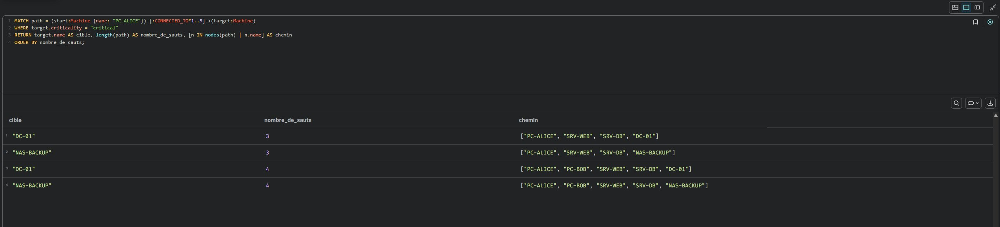

**Commentaire :** Cette requête généralise la précédente : au lieu de cibler uniquement DC-01, elle recherche tous les chemins depuis PC-ALICE vers l'ensemble des machines critiques. Le résultat révèle quatre chemins d'attaque distincts menant aux deux machines critiques du système, DC-01 et NAS-BACKUP. Les deux chemins les plus courts atteignent ces cibles en seulement trois sauts via `PC-ALICE → SRV-WEB → SRV-DB`, tandis que deux chemins alternatifs de quatre sauts transitent par le poste PC-BOB. La fonction `length(path)` quantifie la distance d'attaque et permet de prioriser : plus un chemin est court, plus la cible est rapidement atteignable. Cette analyse démontre que les deux ressources les plus critiques de l'entreprise sont accessibles depuis un simple poste utilisateur.

### R7 — Ressources sensibles accessibles depuis PC-ALICE

```cypher
MATCH path = (start:Machine {name: "PC-ALICE"})-[:CONNECTED_TO*1..5]->(m:Machine)-[:HOSTS]->(r:Resource)
RETURN r.name AS ressource, r.sensitivity AS sensibilite, m.name AS hebergee_sur,
       [n IN nodes(path) | n.name] AS chemin_reseau
ORDER BY r.sensitivity DESC;
```

**Résultat :**

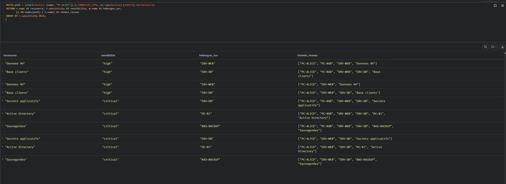

**Commentaire :** Cette requête prolonge l'analyse des chemins jusqu'à leur finalité : les données. Elle suit les connexions réseau depuis PC-ALICE puis la relation HOSTS pour identifier toutes les ressources sensibles atteignables. Le résultat est sans appel : l'intégralité des ressources de l'entreprise est accessible depuis le poste compromis, y compris les trois ressources critiques que sont l'Active Directory, les secrets applicatifs et les sauvegardes. Le tableau présente plusieurs lignes par ressource car chacune est joignable par plusieurs chemins distincts (par exemple via le trajet direct ou via un détour par PC-BOB), ce qui signifie qu'aucune ressource n'est protégée par une route unique. Le tri par sensibilité décroissante met en évidence en priorité les cibles critiques. Cette analyse justifie à elle seule l'urgence d'une segmentation réseau.

### R8 — Machines vulnérables sur le chemin d'attaque

```cypher
MATCH path = (start:Machine {name: "PC-ALICE"})-[:CONNECTED_TO*1..5]->(m:Machine)-[:HAS_VULNERABILITY]->(v:Vulnerability)
RETURN DISTINCT m.name AS machine, v.cve AS cve, v.name AS vulnerabilite,
       v.score AS score, v.patch_status AS statut
ORDER BY score DESC;
```

**Résultat :**

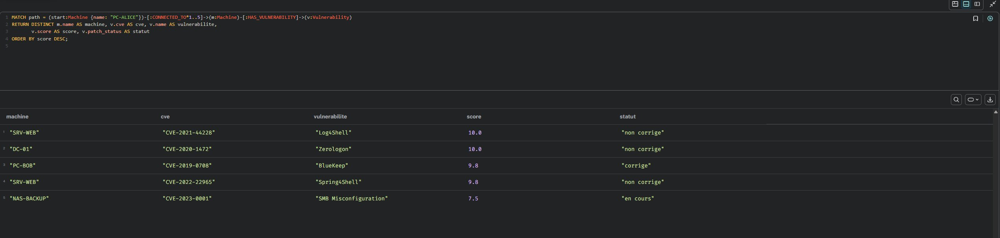

**Commentaire :** Cette requête croise deux dimensions du risque : l'accessibilité réseau et la présence de vulnérabilités. Elle identifie les machines atteignables depuis PC-ALICE qui portent une faille connue, en affichant le score CVSS et surtout le statut de correction. Le résultat met en évidence cinq machines vulnérables sur le chemin d'attaque, classées par gravité. Les deux vulnérabilités les plus critiques — Log4Shell sur SRV-WEB et Zerologon sur DC-01, toutes deux notées 10 — sont encore « non corrigées », ce qui en fait des cibles de choix pour un attaquant. La colonne statut permet de distinguer immédiatement les failles déjà traitées (BlueKeep, corrigé) de celles qui restent ouvertes, et donc de prioriser la remédiation sur les failles à la fois graves, accessibles et non corrigées. L'usage de DISTINCT évite les doublons générés par les multiples chemins menant à une même machine.

### R9 — Utilisateurs et groupes à risque

```cypher
MATCH (u:User)-[:MEMBER_OF]->(g:Group)-[:HAS_ACCESS_TO]->(m:Machine)
WHERE m.criticality IN ["high", "critical"]
RETURN u.name AS utilisateur, g.name AS groupe, m.name AS machine, m.criticality AS criticite
ORDER BY m.criticality DESC;
```

**Résultat :**

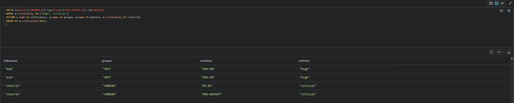

**Commentaire :** Cette requête analyse les droits d'accès hérités via les groupes. Plutôt que de chercher des liens directs entre utilisateurs et machines, elle suit la chaîne `utilisateur → MEMBER_OF → groupe → HAS_ACCESS_TO → machine` pour révéler qui peut atteindre les machines sensibles par appartenance à un groupe. Le résultat met en évidence deux problèmes de droits. D'une part, la stagiaire eve, membre du groupe DEV, hérite d'un accès au serveur de base de données SRV-DB alors qu'un compte stagiaire ne devrait pas atteindre une ressource de criticité élevée. D'autre part, l'administrateur charlie dispose, via le groupe ADMINS, d'un accès aux deux machines critiques DC-01 et NAS-BACKUP : la compromission de ce seul compte entraînerait celle du cœur du système d'information. Cette analyse illustre la capacité du modèle graphe à détecter les risques liés aux droits indirects, invisibles si l'on n'examine que les accès directs.

### R10 — Contrôle de segmentation réseau

```cypher
MATCH (m1:Machine {name: "PC-ALICE"})-[:IN_VLAN]->(v1:VLAN)
MATCH (m2:Machine {name: "SRV-DB"})-[:IN_VLAN]->(v2:VLAN)
RETURN v1.name AS vlan_source, v2.name AS vlan_cible,
       exists((v1)-[:ALLOWED_TO]->(v2)) AS flux_autorise;
```

**Résultat :**

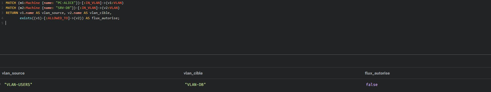

**Commentaire :** Cette requête vérifie l'efficacité de la proposition de segmentation réseau. Elle identifie le VLAN du poste compromis PC-ALICE (VLAN-USERS) et celui du serveur de base de données SRV-DB (VLAN-DB), puis teste, grâce à la fonction `exists()`, s'il existe une règle de pare-feu (relation ALLOWED_TO) autorisant le flux entre ces deux zones. Le résultat `false` démontre qu'avec la segmentation mise en place, aucun flux n'est autorisé directement du segment utilisateur vers le segment des données. Le chemin d'attaque identifié dans les analyses précédentes, qui permettait à PC-ALICE d'atteindre SRV-DB et au-delà, est donc rompu au niveau réseau. Cette requête fait le lien entre le constat (les ressources critiques sont accessibles dans l'architecture actuelle) et la remédiation (la segmentation isole les zones et bloque le mouvement latéral). Elle constitue la preuve mesurable de la pertinence de la recommandation de sécurité.

### R11 — Surface d'exposition Internet

```cypher
MATCH (n)-[:EXPOSED_TO_INTERNET]->(:Internet)
RETURN labels(n)[0] AS type, n.name AS nom
ORDER BY type;
```

**Résultat :**

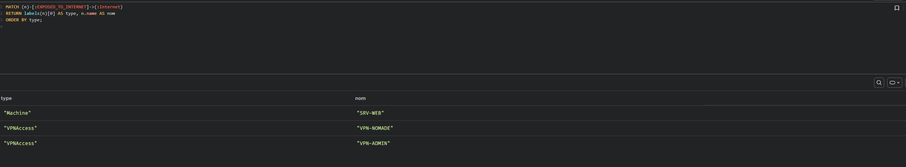

**Commentaire :** Cette requête cartographie la surface d'exposition externe du système d'information, c'est-à-dire les éléments directement joignables depuis Internet. Elle suit la relation EXPOSED_TO_INTERNET et révèle trois points d'entrée : le serveur web SRV-WEB et les deux accès distants VPN-NOMADE et VPN-ADMIN. Ces éléments constituent le périmètre d'attaque accessible avant toute intrusion interne. Le serveur SRV-WEB est particulièrement préoccupant car il combine exposition Internet et vulnérabilité critique non corrigée (Log4Shell, identifiée précédemment), offrant un vecteur d'entrée direct. L'exposition d'un VPN d'administration (VPN-ADMIN), qui ouvre l'accès au segment d'administration, représente également un risque élevé et mériterait un contrôle d'accès renforcé. Cette analyse permet de prioriser le durcissement des points exposés, première ligne de défense du système.

### R12 — Alertes de tentatives d'authentification (brute-force)

```cypher
MATCH (l:LoginLog)-[:LOGIN_ON]->(m:Machine)
WHERE l.status = "failed" AND l.failed_attempts >= 5
OPTIONAL MATCH (l)-[:LOGIN_BY]->(u:User)
RETURN m.name AS machine, u.name AS utilisateur, l.failed_attempts AS tentatives, l.timestamp AS horodatage
ORDER BY tentatives DESC;
```

**Résultat :**

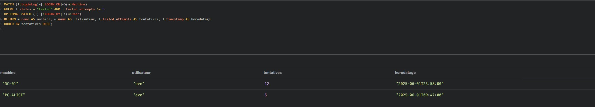

**Commentaire :** Cette requête exploite les journaux de connexion pour détecter les tentatives d'authentification suspectes. Elle filtre les événements ayant échoué avec au moins cinq tentatives, seuil caractéristique d'une attaque par force brute. Le résultat remonte deux alertes, toutes deux associées au compte de la stagiaire eve : douze échecs sur le contrôleur de domaine DC-01 à 23h58, et cinq échecs sur le poste PC-ALICE. Plusieurs indicateurs convergent vers un comportement malveillant : le nombre élevé de tentatives, l'horodatage nocturne et surtout le ciblage du contrôleur de domaine, la machine la plus sensible du système. Recoupé avec l'analyse des droits (où eve apparaissait déjà avec des accès excessifs), ce compte cumule les signaux de risque et devrait faire l'objet d'une investigation prioritaire. Cette requête illustre l'intérêt d'intégrer les logs dans le graphe : en reliant journaux, utilisateurs et machines, le modèle permet de corréler une activité suspecte avec le reste du contexte de sécurité.

### R13 — Chemins d'attaque Active Directory

```cypher
MATCH (n)-[:HAS_AD_RIGHT]->(a:ADRight)-[:AD_RIGHT_ON]->(r:Resource)
RETURN labels(n)[0] AS type_porteur, n.name AS porteur, a.name AS droit, a.level AS niveau, r.name AS cible
ORDER BY a.level DESC;
```

**Résultat :**

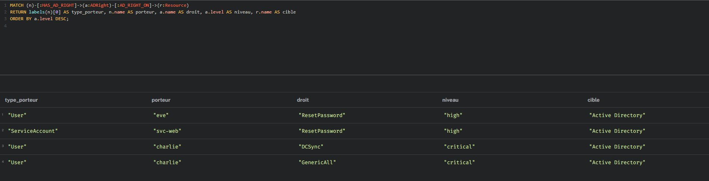

**Commentaire :** Cette requête identifie les chemins d'attaque visant l'Active Directory, en suivant la chaîne `porteur → HAS_AD_RIGHT → droit AD → AD_RIGHT_ON → Active Directory`. Elle révèle quels comptes détiennent des droits sensibles sur l'annuaire, en distinguant les utilisateurs des comptes de service. Le résultat met en évidence quatre attributions de droits, dont deux critiques détenues par l'administrateur charlie : DCSync, qui permet de répliquer l'ensemble des secrets du domaine, et GenericAll, qui confère un contrôle total sur les objets de l'annuaire. La compromission de ce compte donnerait à un attaquant les moyens de prendre le contrôle complet du domaine. La requête révèle également que le compte de service svc-web et la stagiaire eve possèdent le droit ResetPassword sur l'AD, des attributions anormales : les comptes de service sont rarement surveillés et constituent un angle d'attaque négligé, tandis qu'un compte stagiaire ne devrait disposer d'aucun droit sur l'annuaire. La distinction entre types de porteurs (User et ServiceAccount) montre la finesse du modèle, capable de relier différents types d'entités à une même ressource critique.

### R14 — Machines non patchées

```cypher
MATCH (m:Machine)-[:HAS_VULNERABILITY]->(v:Vulnerability)
WHERE v.patch_status <> "corrige"
RETURN m.name AS machine, m.last_patch_date AS dernier_patch,
       collect(v.name + " (" + v.patch_status + ")") AS vulns_ouvertes
ORDER BY m.last_patch_date;
```

**Résultat :**

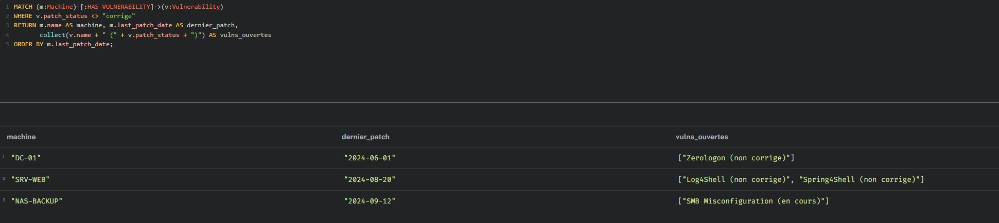

**Commentaire :** Cette requête croise les vulnérabilités avec l'état de mise à jour des machines, en s'appuyant sur les propriétés patch_status et last_patch_date. Elle ne retient que les machines portant au moins une vulnérabilité non corrigée et les classe par ancienneté de leur dernier correctif. Le résultat fait apparaître trois machines à risque. Le contrôleur de domaine DC-01 ressort en tête : c'est la machine la plus anciennement patchée (juin 2024) alors qu'elle est la plus critique du système, et sa vulnérabilité Zerologon reste ouverte. Le serveur SRV-WEB cumule deux failles non corrigées (Log4Shell et Spring4Shell), tandis que NAS-BACKUP présente une mauvaise configuration en cours de traitement. La fonction collect() regroupe toutes les vulnérabilités d'une machine sur une seule ligne, offrant une vue synthétique par machine plutôt qu'une liste éclatée. Le tri par date de dernier patch fournit un ordre de priorité concret pour les équipes : traiter d'abord les machines critiques laissées sans correctif depuis le plus longtemps. Cette analyse transforme le graphe en véritable tableau de bord de la dette de sécurité.

---

## Synthèse

Ce livrable présente 3 requêtes de création et 11 requêtes d'analyse, soit 14 requêtes au total, dépassant le minimum demandé (3 créations et 5 analyses). Les analyses couvrent l'ensemble de la problématique cyber : identification des chemins d'attaque (R5, R6, R7), repérage des machines vulnérables (R8, R14), analyse des droits à risque (R9, R13), contrôle des mesures de sécurité (R10), cartographie de l'exposition (R11) et détection d'activité suspecte (R12). Elles démontrent qu'une base de données orientée graphe permet non seulement de modéliser un système d'information, mais surtout d'en analyser les risques de manière concrète et exploitable.
